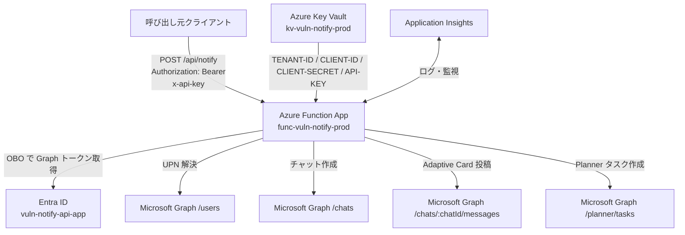
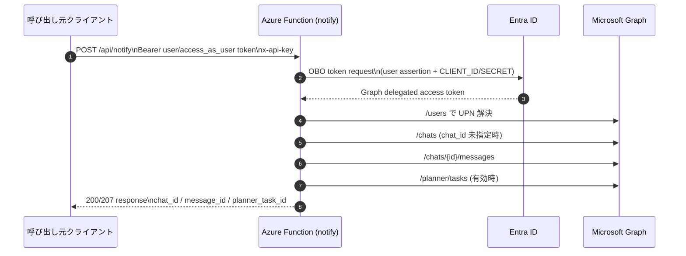

# ソフトウェア脆弱性通知システム 実装ガイド

Azure Functions と Microsoft Graph を使って、脆弱性情報をグループチャット通知し、必要に応じて Planner タスクを登録するシステムです。

## 現在の実装方式

- Function 受信: HTTP Trigger (`POST /api/notify`)
- Function 呼び出し認証: `x-api-key`
- Graph 認証: 委任権限 + OBO (On-Behalf-Of)
- Teams 通知先: グループチャット (`/chats/{id}/messages`)
- Planner 連携: オプション (`planner.enabled=true` で作成)

## システム構成

```text
呼び出し元クライアント
  └─ API トークン (scope: access_as_user)
        ↓ Authorization: Bearer
Azure Functions (notify)
  ├─ OBO で Graph トークン取得
  ├─ /users で UPN 解決
  ├─ /chats でグループチャット作成 (chat_id 未指定時)
  ├─ /chats/{id}/messages で Adaptive Card 投稿
  └─ /planner/tasks でタスク作成 (オプション)

シークレット管理: Azure Key Vault
監視: Application Insights
```

## 構成イメージ

### 全体アーキテクチャ



### 認証フロー（OBO）



## 主要リソース

| 種別 | 名前 |
|---|---|
| Resource Group | `vuln-notify-rg` |
| Function App | `func-vuln-notify-prod-<suffix>` |
| Key Vault | `kvvulnnotifyprod<suffix>` |

## ディレクトリ構成

```text
vuln-notification/
├── azuredeploy.bicep
├── azuredeploy.json
├── azuredeploy.parameters.json
├── function-app/
│   ├── .funcignore
│   ├── function_app.py
│   ├── host.json
│   ├── requirements.txt
│   ├── RUNBOOK.md
│   ├── SENDER_GUIDE.md
│   └── Test-VulnNotify.ps1
└── README.md
```

## Entra アプリ構成（例）

### API 側アプリ

- アプリ名: `vuln-notify-api-app`
- AppId: `<API_APP_ID>`
- Expose an API:
  - Application ID URI: `api://<API_APP_ID>`
  - Scope: `access_as_user`
- Graph 委任権限:
  - `Chat.Create`
  - `ChatMessage.Send`
  - `Tasks.ReadWrite`
  - `User.ReadBasic.All`

### クライアント側アプリ

- アプリ名: `vuln-notify-client-app`
- API 側の `access_as_user` を Delegated で付与済み

## Key Vault シークレット

| シークレット名 | 用途 |
|---|---|
| `TENANT-ID` | Entra テナント ID |
| `CLIENT-ID` | API 側アプリの AppId |
| `CLIENT-SECRET` | API 側アプリのシークレット |
| `API-KEY` | Function 呼び出しキー |

Function App 設定は Key Vault 参照を利用します。

## 環境構築手順（詳細）

この章は「新規環境を 0 から構築する」場合の手順です。既存環境の更新だけを行う場合は、デプロイ手順とテスト手順のみ実施してください。

### 1. 前提ツール

- Azure CLI (`az`)
- Azure Functions Core Tools (`func`)
- Python 3.11
- PowerShell 7 以降

バージョン確認:

```powershell
az version
func --version
python --version
$PSVersionTable.PSVersion
```

### 2. Azure サインインとサブスクリプション選択

```powershell
az login
az account list --output table
az account set --subscription "<SUBSCRIPTION_ID_OR_NAME>"
az account show --output table
```

### 3. インフラを Bicep で展開

リソース グループを作成後、Bicep を実行します。

```powershell
az group create --name vuln-notify-rg --location japaneast

$deploymentName = "vuln-notify-infra"

az deployment group create \
  --name $deploymentName \
  --resource-group vuln-notify-rg \
  --template-file azuredeploy.bicep \
  --parameters @azuredeploy.parameters.json
```

必要に応じてサフィックスを明示指定できます。

```powershell
az deployment group create \
  --name $deploymentName \
  --resource-group vuln-notify-rg \
  --template-file azuredeploy.bicep \
  --parameters @azuredeploy.parameters.json \
  --parameters nameSuffix=dev01
```

展開後に以下が作成されていることを確認します。

```powershell
$funcName = az deployment group show -g vuln-notify-rg -n $deploymentName --query "properties.outputs.functionAppUrl.value" -o tsv
$funcHost = $funcName -replace '^https://',''
$funcApp = $funcHost -replace '\\.azurewebsites\\.net$',''

$kvName = az deployment group show -g vuln-notify-rg -n $deploymentName --query "properties.outputs.keyVaultName.value" -o tsv

"Function App: $funcApp"
"Key Vault: $kvName"
```

### 4. Entra アプリを準備（OBO 用）

この手順は Azure portal で実施します。

#### Step 1. API 側アプリを作成

1. Entra ID > アプリの登録 > 新規登録 を開く
2. 名前を `vuln-notify-api-app` にして作成
3. 作成後、`アプリケーション (クライアント) ID` を控える（後で `<API_APP_ID>` として使用）

#### Step 2. API 側で Expose an API を設定

1. `vuln-notify-api-app` の Expose an API を開く
2. Application ID URI を `api://<API_APP_ID>` で設定
3. Scope を追加:
   - Scope 名: `access_as_user`
   - 同意表示名: `Access vuln-notify API as user`（任意の分かりやすい名称で可）
   - 状態: Enabled

#### Step 3. API 側に Graph Delegated Permissions を追加

1. `vuln-notify-api-app` > API のアクセス許可 を開く
2. Microsoft Graph の Delegated permissions を追加:
   - `Chat.Create`
   - `ChatMessage.Send`
3. `管理者の同意を与えます` を実行して Granted 状態を確認

#### Step 4. API 側アプリの Client secret を作成

1. `vuln-notify-api-app` > 証明書とシークレット を開く
2. 新しいクライアント シークレットを作成
3. シークレット値を控える（この画面を閉じると再表示不可）

#### Step 5. クライアント側アプリを作成

1. Entra ID > アプリの登録 > 新規登録 を開く
2. 名前を `vuln-notify-client-app` にして作成
3. 作成後、クライアント側 AppId を控える（必要に応じて）

#### Step 6. クライアント側に API スコープを付与

1. `vuln-notify-client-app` > API のアクセス許可 を開く
#### Step 7. 最終確認（OBO 前提）

以下が揃っていれば OBO 前提の Entra 構成は完了です。

- API 側 AppId が取得できている
- API 側で `access_as_user` が公開済み
- クライアント側で `access_as_user` が付与済み
- Graph Delegated permissions が Granted 済み
- API 側 Client secret が払い出し済み

### 5. API 側アプリのシークレットを作成

#### Step 1. 対象アプリを開く

1. Entra ID > アプリの登録 を開く
2. `vuln-notify-api-app` を選択
3. 左メニューの 証明書とシークレット を開く

#### Step 2. 新しいクライアント シークレットを作成

1. `新しいクライアント シークレット` をクリック
2. 説明を入力（例: `vuln-notify-prod-secret`）
3. 有効期限を選択（運用ポリシーに合わせる）
4. 追加 をクリック

#### Step 3. シークレット値を安全に保管

1. 作成直後に `値 (Value)` をコピー
2. この値を `<API_APP_CLIENT_SECRET>` として次の Step 6 で Key Vault に保存
3. 画面を離れると値は再表示できないため、コピー漏れ時は再発行する

#### Step 4. AppId とシークレットの対応を確認

1. アプリの 概要 で `アプリケーション (クライアント) ID` を再確認
2. `CLIENT-ID` にはこの AppId、`CLIENT-SECRET` には Step 3 の値を設定することを確認

#### Step 5. ローテーション方針を決める（推奨）

- 本番運用では有効期限の 30 日以上前に再発行し、Key Vault の `CLIENT-SECRET` を更新
- 更新後は Function App を再起動して新シークレット参照を反映

### 6. Key Vault シークレットを投入

この手順は Azure CLI で実施します。まず対象 Key Vault 名を取得してから、必要シークレットを登録します。

#### Step 1. 対象 Key Vault 名を取得

```powershell
$kvName = az deployment group show -g vuln-notify-rg -n $deploymentName --query "properties.outputs.keyVaultName.value" -o tsv
"Key Vault: $kvName"
```

#### Step 2. 必須シークレットを登録

```powershell
az keyvault secret set --vault-name $kvName --name TENANT-ID --value "<TENANT_ID>"
az keyvault secret set --vault-name $kvName --name CLIENT-ID --value "<API_APP_ID>"
az keyvault secret set --vault-name $kvName --name CLIENT-SECRET --value "<API_APP_CLIENT_SECRET>"
az keyvault secret set --vault-name $kvName --name API-KEY --value "<RANDOM_STRONG_KEY>"
```

#### Step 3. 登録結果を確認

```powershell
az keyvault secret show --vault-name $kvName --name TENANT-ID --query id -o tsv
az keyvault secret show --vault-name $kvName --name CLIENT-ID --query id -o tsv
az keyvault secret show --vault-name $kvName --name CLIENT-SECRET --query id -o tsv
az keyvault secret show --vault-name $kvName --name API-KEY --query id -o tsv
```

#### Step 4. 値の整合性チェック（推奨）

```powershell
az keyvault secret show --vault-name $kvName --name CLIENT-ID --query value -o tsv
```

- 出力された `CLIENT-ID` が `vuln-notify-api-app` の AppId と一致していることを確認
- `CLIENT-SECRET` は平文確認を最小限にし、ログや履歴に残さない運用を推奨

### 7. Function App 設定の反映確認

Function App のアプリ設定で Key Vault 参照が正しく構成されていることを確認し、必要に応じて再起動します。

#### Step 1. Function App 名を取得

```powershell
$funcUrl = az deployment group show -g vuln-notify-rg -n $deploymentName --query "properties.outputs.functionAppUrl.value" -o tsv
$funcApp = $funcUrl -replace '^https://','' -replace '\\.azurewebsites\\.net$',''
"Function App: $funcApp"
```

#### Step 2. アプリ設定を確認

```powershell
az functionapp config appsettings list \
  --name $funcApp \
  --resource-group vuln-notify-rg \
  --output table
```

確認ポイント:

- `TENANT_ID`
- `CLIENT_ID`
- `CLIENT_SECRET`
- `API_KEY`

上記 4 つが存在し、値が `@Microsoft.KeyVault(...)` 形式で設定されていることを確認します。

#### Step 3. Function App を再起動して参照を再読込

```powershell
az functionapp restart \
  --name $funcApp \
  --resource-group vuln-notify-rg
```

#### Step 4. 反映後の動作確認（最小）

```powershell
az functionapp show --name $funcApp --resource-group vuln-notify-rg --query "state" -o tsv
```

- `Running` を確認
- その後、本 README の「テスト手順」を実行して `status: sent` を確認

### 8. Planner ID / Bucket ID を取得

Planner タスク連携を使う場合は `plan_id` と `bucket_id` が必要です。

#### Step 1. Graph トークンを取得

```powershell
$graphToken = az account get-access-token --resource-type ms-graph --query accessToken -o tsv
$graphHeaders = @{ Authorization = "Bearer $graphToken" }
```

#### Step 2. 利用可能な Planner Plan を確認

```powershell
az rest \
  --method GET \
  --url "https://graph.microsoft.com/v1.0/me/planner/plans" \
  --headers "Authorization=Bearer $graphToken" \
  --output json
```

出力の `value[].id` が Planner Plan ID (`plan_id`) です。

#### Step 3. Plan に属する Bucket を確認

```powershell
$planId = "<PLAN_ID>"

az rest \
  --method GET \
  --url "https://graph.microsoft.com/v1.0/planner/plans/$planId/buckets" \
  --headers "Authorization=Bearer $graphToken" \
  --output json
```

出力の `value[].id` が Bucket ID (`bucket_id`) です。

#### Step 4. PowerShell で見やすく一覧表示（任意）

```powershell
$plans = Invoke-RestMethod -Method GET -Uri "https://graph.microsoft.com/v1.0/me/planner/plans" -Headers $graphHeaders
$plans.value | Select-Object id,title,owner | Format-Table -AutoSize

$planId = "<PLAN_ID>"
$buckets = Invoke-RestMethod -Method GET -Uri "https://graph.microsoft.com/v1.0/planner/plans/$planId/buckets" -Headers $graphHeaders
$buckets.value | Select-Object id,name,orderHint | Format-Table -AutoSize
```

#### Step 5. 取得した ID をテスト手順へ反映

- `-PlannerPlanId` に `plan_id` を指定
- `-PlannerBucketId` に `bucket_id` を指定
- JSON で送る場合は `planner.plan_id` と `planner.bucket_id` に指定

### 9. ローカル依存関係（任意）

ローカル実行や静的チェックを行う場合:

```powershell
Push-Location function-app
python -m venv .venv
.\.venv\Scripts\Activate.ps1
pip install -r requirements.txt
Pop-Location
```

### 10. 初回疎通確認

1. この後の「デプロイ手順」でコードを publish
2. 「テスト手順」を実行して `status: sent` を確認
3. Planner 有効時は `planner_task_id` と担当者数を確認

## API 仕様（現在）

### エンドポイント

```http
POST https://<FUNCTION_APP_NAME>.azurewebsites.net/api/notify
Headers:
  x-api-key: <API-KEY>
  Authorization: Bearer <user token or access_as_user token>
Content-Type: application/json
```

### 最小リクエスト例

```json
{
  "upns": [
    "analyst01@contoso.com",
    "owner01@contoso.com"
  ],
  "title": "脆弱性通知: CVE-2026-12345",
  "message": "OpenSSL の重大脆弱性を検知しました。"
}
```

### Planner 連携を有効化する例

```json
{
  "upns": [
    "analyst01@contoso.com",
    "owner01@contoso.com",
    "manager01@contoso.com"
  ],
  "planner": {
    "enabled": true,
    "plan_id": "<PLANNER_PLAN_ID>",
    "bucket_id": "<PLANNER_BUCKET_ID>"
  },
  "facts": {
    "cve_id": "CVE-2026-12345",
    "severity": "High",
    "cvss": "9.1",
    "component": "OpenSSL",
    "due_date": "2026-04-13"
  }
}
```

## Planner 担当者の仕様

- 既定: `upns` の全員を担当者として割り当て
- `planner.assignee_upn` を指定した場合: その 1 名のみ割り当て
- `planner.assignee_upns` を指定した場合: 指定した複数 UPN を割り当て

## デプロイ手順

```powershell
Push-Location function-app
func azure functionapp publish func-vuln-notify-prod --python --build remote
Pop-Location
```

## テスト手順

```powershell
$token = az account get-access-token --scope "api://<API_APP_ID>/access_as_user" --query accessToken -o tsv
$env:VULN_NOTIFY_API_KEY = az keyvault secret show --vault-name <KEY_VAULT_NAME> --name API-KEY --query value -o tsv

.\function-app\Test-VulnNotify.ps1 \
  -ApiKey $env:VULN_NOTIFY_API_KEY \
  -UserAccessToken $token \
  -Upns 'analyst01@contoso.com','owner01@contoso.com','manager01@contoso.com' \
  -CreatePlannerTask \
  -PlannerPlanId '<PLANNER_PLAN_ID>' \
  -PlannerBucketId '<PLANNER_BUCKET_ID>'
```

## 最近の検証結果

- グループチャット投稿: 成功
- Planner タスク作成: 成功
- Planner 担当者 3 名割り当て: 成功

## 補足ドキュメント

詳細手順は `function-app/RUNBOOK.md` を参照してください。

送信側実装は `function-app/SENDER_GUIDE.md` を参照してください。
