# ソフトウェア脆弱性通知システム 実装ガイド

Azure Functions と Microsoft Graph を使って、脆弱性情報をグループチャット通知し、必要に応じて Planner タスクを登録するシステムです。

## 現在の実装方式

- Function 受信: HTTP Trigger (`POST /api/notify`)
- Graph 認証: 委任権限 + OBO (On-Behalf-Of)
- Teams 通知先: グループチャット (`/chats/{id}/messages`)
- Planner 連携: オプション (`planner.enabled=true` で作成)

## システム構成

```text
呼び出し元クライアント
  └─ API トークン (scope: access_as_user)
        ↓ Authorization: Bearer
Azure Functions (notify)
  ├─ OBO で Graph トークン取得
  ├─ /users で UPN 解決
  ├─ /chats でグループチャット作成 (chat_id 未指定時)
  ├─ /chats/{id}/messages で Adaptive Card 投稿
  └─ /planner/tasks でタスク作成 (オプション)

シークレット管理: Azure Key Vault
監視: Application Insights
```

## 構成イメージ

### 全体アーキテクチャ

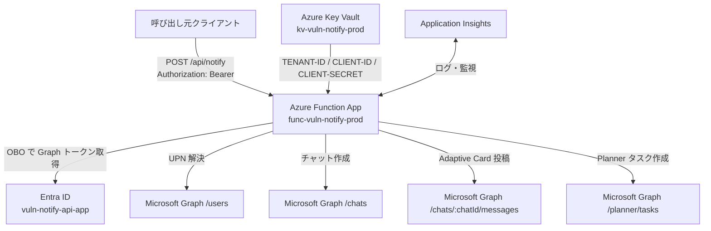

### 認証フロー（OBO）

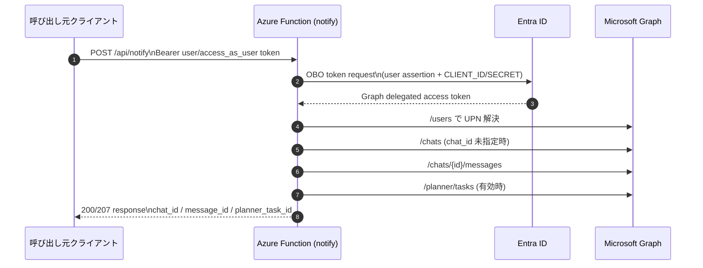

## 主要リソース

| 種別 | 名前 |
|---|---|
| Resource Group | `vuln-notify-rg` |
| Function App | `func-vuln-notify-prod-<suffix>` |
| Key Vault | `kvvulnnotifyprod<suffix>` |

## ディレクトリ構成

```text
vuln-notification/
├── azuredeploy.bicep
├── azuredeploy.parameters.json
├── function-app/
│   ├── .funcignore
│   ├── function_app.py
│   ├── host.json
│   ├── requirements.txt
│   ├── RUNBOOK.md
│   ├── SENDER_GUIDE.md
│   └── Test-VulnNotify.ps1
└── README.md
```

## Entra アプリ構成（例）

### API 側アプリ

- アプリ名: `vuln-notify-api-app`
- AppId: `<API_APP_ID>`
- Expose an API:
  - Application ID URI: `api://<API_APP_ID>`
  - Scope: `access_as_user`
- Graph 委任権限:
  - `Chat.Create`
  - `ChatMessage.Send`
  - `Tasks.ReadWrite`
  - `User.ReadBasic.All`

### クライアント側アプリ

- アプリ名: `vuln-notify-client-app`
- API 側の `access_as_user` を Delegated で付与済み

## Key Vault シークレット

| シークレット名 | 用途 |
|---|---|
| `TENANT-ID` | Entra テナント ID |
| `CLIENT-ID` | API 側アプリの AppId |
| `CLIENT-SECRET` | API 側アプリのシークレット |

Function App 設定は Key Vault 参照を利用します。

## 環境構築手順（詳細）

この章は「新規環境を 0 から構築する」場合の手順です。既存環境の更新だけを行う場合は、デプロイ手順とテスト手順のみ実施してください。

### 0. GitHub から対象ファイルを取得

このガイドで利用するファイル一式は GitHub リポジトリから取得します。

#### 方法 A: `git clone`（推奨）

```powershell
git clone https://github.com/mattu0119/microsoft-security-field-notes.git
cd microsoft-security-field-notes/vuln-notification
```

#### 方法 B: ZIP ダウンロード

1. GitHub のリポジトリページで `Code` > `Download ZIP` を選択
2. ZIP を展開
3. 展開したフォルダ内の `vuln-notification` ディレクトリに移動

この後のコマンドは `vuln-notification` ディレクトリをカレントとして実行します。

### 1. 前提ツール

| ツール | 用途 | 最小バージョン |
|---|---|---|
| Azure CLI (`az`) | Azure リソース管理・デプロイ | 2.60 以上 |
| Azure Functions Core Tools (`func`) | Function App のローカル実行・デプロイ | 4.x |
| Python | Function App ランタイム | 3.11 |
| PowerShell | スクリプト実行・テスト | 7.0 以上 |

#### インストール手順（Windows）

**Azure CLI:**

```powershell
winget install --id Microsoft.AzureCLI -e
```

> 手動インストール: <https://learn.microsoft.com/cli/azure/install-azure-cli-windows>

**Azure Functions Core Tools:**

```powershell
winget install --id Microsoft.Azure.FunctionsCoreTools -e
```

> 手動インストール: <https://learn.microsoft.com/azure/azure-functions/functions-run-local#install-the-azure-functions-core-tools>

**Python 3.11:**

```powershell
winget install --id Python.Python.3.11 -e
```

> 手動インストール: <https://www.python.org/downloads/>

**PowerShell 7:**

```powershell
winget install --id Microsoft.PowerShell -e
```

> 手動インストール: <https://learn.microsoft.com/powershell/scripting/install/installing-powershell-on-windows>

#### バージョン確認

```powershell
az version
func --version
python --version
$PSVersionTable.PSVersion
```

すべてのコマンドが正常に実行でき、バージョンが要件を満たしていることを確認してから次に進んでください。

### 1-1. リソース展開に必要な Azure ロール

このテンプレートではリソース作成に加えて、Key Vault スコープのロール割り当て (`Microsoft.Authorization/roleAssignments`) も実行します。

最小構成の目安:

| スコープ | 必要ロール | 用途 |
|---|---|---|
| サブスクリプション（または対象 RG） | `Contributor` | Resource Group / Function App / Key Vault などのリソース作成 |
| 対象 Resource Group（または Key Vault） | `User Access Administrator` | Function の Managed Identity に Key Vault Secrets User ロールを付与 |

簡易運用では `Owner` を付与しても実行できますが、公開環境では上記 2 ロール分離を推奨します。

### 1-2. Entra ID の管理者同意に必要なロール

Step 4 の Entra アプリ構成で `管理者の同意を与えます（Grant admin consent）` を実行するには、以下のいずれかの Entra ID ロールが必要です。

| Entra ID ロール | 備考 |
|---|---|
| `Cloud Application Administrator` | 推奨（最小権限） |
| `Application Administrator` | |
| `Privileged Role Administrator` | |
| `Global Administrator` | 最も広い権限。必要な場合のみ |

> [!NOTE]
> ロールが不足している場合、Azure portal の `管理者の同意を与えます` ボタンがグレーアウトされます。テナント管理者に依頼して、上記いずれかのロールを付与してもらってください。

### 2. Azure サインインとサブスクリプション選択

```powershell
az login
az account list --output table
az account set --subscription "<SUBSCRIPTION_ID_OR_NAME>"
az account show --output table
```

### 3. インフラを Bicep で展開

リソース グループを作成後、Bicep を実行します。

```powershell
az group create --name vuln-notify-rg --location japaneast

$deploymentName = "vuln-notify-infra"

az deployment group create \
  --name $deploymentName \
  --resource-group vuln-notify-rg \
  --template-file azuredeploy.bicep \
  --parameters @azuredeploy.parameters.json
```

1行版:

```powershell
az deployment group create --name $deploymentName --resource-group vuln-notify-rg --template-file azuredeploy.bicep --parameters "@azuredeploy.parameters.json"
```

必要に応じてサフィックスを明示指定できます。

```powershell
az deployment group create \
  --name $deploymentName \
  --resource-group vuln-notify-rg \
  --template-file azuredeploy.bicep \
  --parameters @azuredeploy.parameters.json \
  --parameters nameSuffix=dev01
```

1行版:

```powershell
az deployment group create --name $deploymentName --resource-group vuln-notify-rg --template-file azuredeploy.bicep --parameters "@azuredeploy.parameters.json" --parameters nameSuffix=dev01
```

展開後に以下が作成されていることを確認します。

```powershell
$funcName = az deployment group show -g vuln-notify-rg -n $deploymentName --query "properties.outputs.functionAppUrl.value" -o tsv
$funcHost = $funcName -replace '^https://',''
$funcApp = $funcHost -replace '\\.azurewebsites\\.net$',''

$kvName = az deployment group show -g vuln-notify-rg -n $deploymentName --query "properties.outputs.keyVaultName.value" -o tsv

"Function App: $funcApp"
"Key Vault: $kvName"
```

### 4. Entra アプリを準備（OBO 用）

この手順は Azure portal で実施します。

#### Step 1. API 側アプリを作成

1. Entra ID > アプリの登録 > 新規登録 を開く
2. 名前を `vuln-notify-api-app` にして作成
3. 作成後、`アプリケーション (クライアント) ID` を控える（後で `<API_APP_ID>` として使用）

<p align="center">
  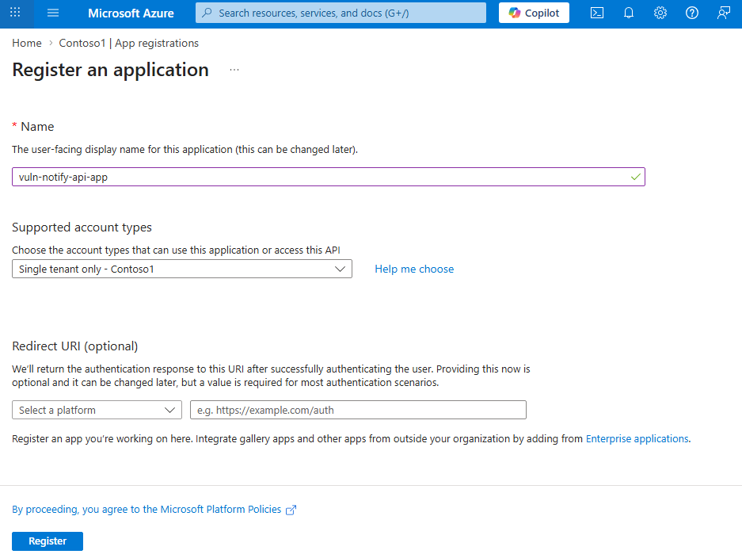
</p>
<p align="center"><em>Step 1: Entra ID でアプリを新規登録</em></p>

#### Step 2. API 側で Expose an API を設定

1. `vuln-notify-api-app` の Expose an API を開く
2. Application ID URI を `api://<API_APP_ID>` で設定

<p align="center">
  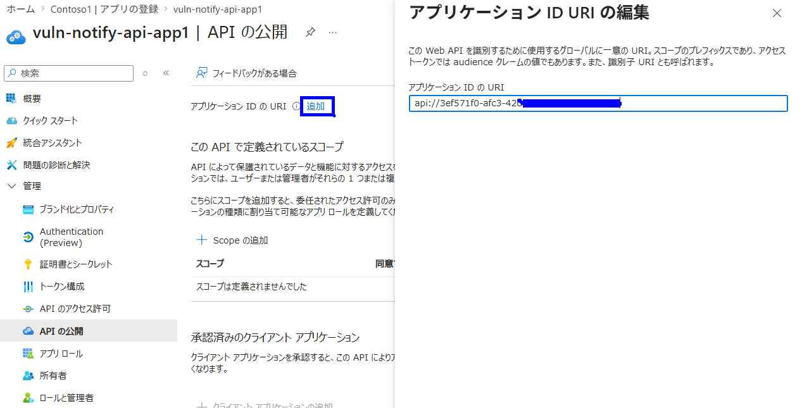
</p>
<p align="center"><em>Step 2: Expose an API で access_as_user スコープを追加</em></p>

3. Scope を追加:
   - Scope 名: `access_as_user`
   - 管理者の同意の表示名: `Access vuln-notify API as user`（管理者が同意画面で確認する名称）
   - 管理者の同意の説明: 例 `この API が Teams 通知と Planner タスク作成に必要なアクセスを行うことを許可します。`（必須）
   - 状態: Enabled

<p align="center">
  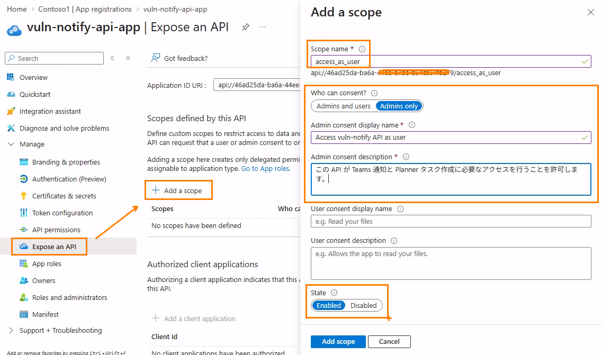
</p>
<p align="center"><em>Step 2: Scope 追加時に管理者同意の表示名を入力</em></p>

> [!NOTE]
> 管理者の同意は、テナント管理者がアプリ権限を組織に対して承認する操作です。未実施の場合、ユーザーがトークン取得に失敗し、OBO フローが成立しません。


#### Step 3. API 側に Graph Delegated Permissions を追加

1. `vuln-notify-api-app` > API のアクセス許可 を開く

<p align="center">
  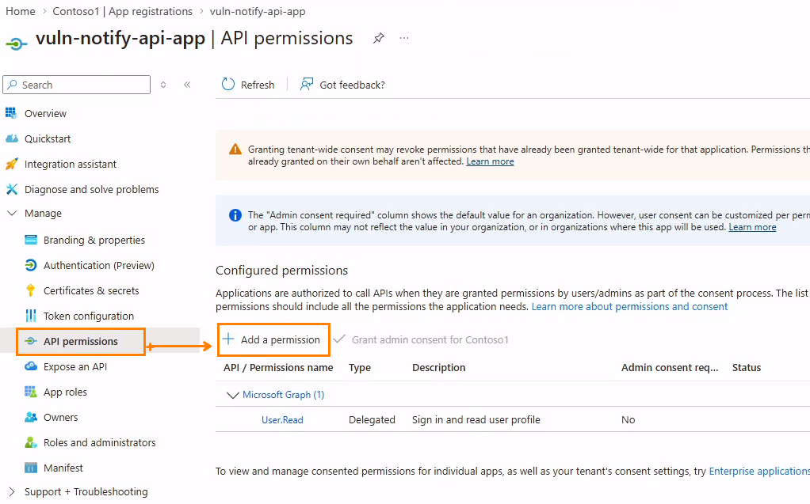
</p>
<p align="center"><em>Step 3: API のアクセス許可から権限を追加</em></p>

2. Microsoft Graph の Delegated permissions を追加:
   - `Chat.Create`
   - `ChatMessage.Send`
   - `Tasks.ReadWrite`（Planner タスクの作成・更新に必要）
   - `User.ReadBasic.All`（UPN からユーザー情報を解決するために必要）
3. `管理者の同意を与えます` を実行して Granted 状態を確認

<p align="center">
  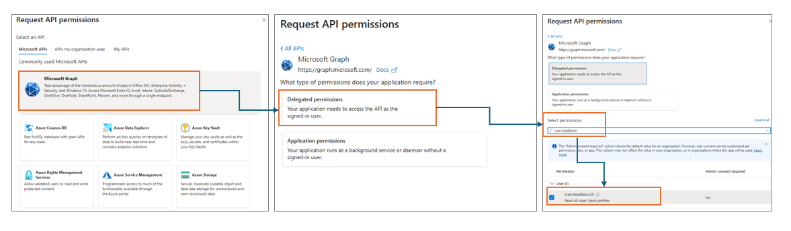
</p>
<p align="center"><em>Step 3: Microsoft Graph > Delegated permissions から必要な権限を追加</em></p>

#### Step 4. API 側アプリの Client secret を作成

1. `vuln-notify-api-app` > 証明書とシークレット を開く
2. 新しいクライアント シークレットを作成
3. シークレット値を控える（この画面を閉じると再表示不可）
4. この値を `<API_APP_CLIENT_SECRET>` として Key Vault シークレット投入時に使用

<p align="center">
  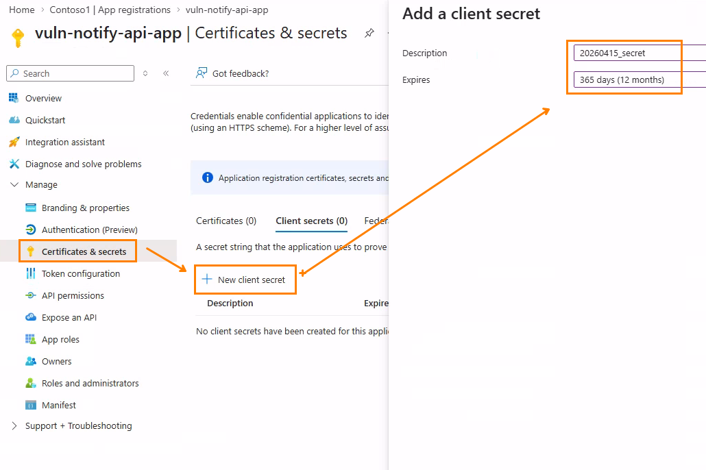
</p>
<p align="center"><em>Step 4: 証明書とシークレットからクライアントシークレットを作成</em></p>

> [!TIP]
> 本番運用では有効期限の 30 日以上前にシークレットを再発行し、Key Vault の `CLIENT-SECRET` を更新してください。更新後は Function App を再起動して新シークレット参照を反映します。

#### Step 5. クライアント側アプリを作成

1. Entra ID > アプリの登録 > 新規登録 を開く
2. 名前を `vuln-notify-client-app` にして作成
3. 作成後、クライアント側 AppId を控える（必要に応じて）

#### Step 6. クライアント側に API スコープを付与

1. `vuln-notify-client-app` > API のアクセス許可 を開く
2. `アクセス許可の追加` をクリック
3. `所属する組織で使用している API` を選択し、`vuln-notify-api-app` を検索して選択
4. `委任されたアクセス許可` を選択し、`access_as_user` をチェックして `アクセス許可の追加` を実行

<p align="center">
  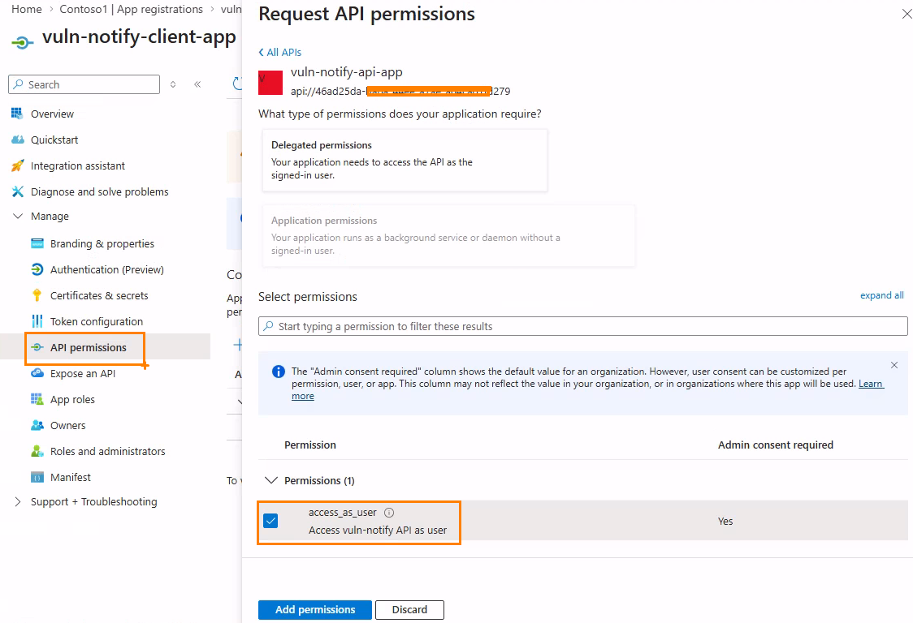
</p>
<p align="center"><em>Step 6: クライアント側アプリに access_as_user の委任権限を付与</em></p>

5. 必要に応じて `管理者の同意を与えます` を実行し、`Granted` 状態を確認

<p align="center">
  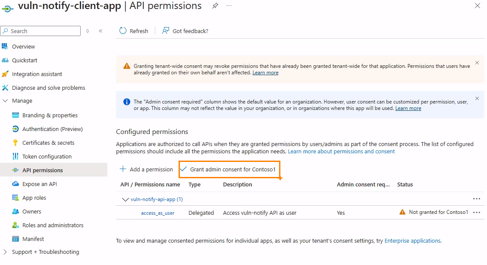
</p>
<p align="center"><em>Step 6: Grant admin consent をクリックして管理者同意を付与</em></p>

> [!WARNING]
> クライアント側で `access_as_user` が付与されていない場合、`api://<API_APP_ID>/access_as_user` のトークン取得に失敗します。

#### Step 7. 最終確認（OBO 前提）

以下が揃っていれば OBO 前提の Entra 構成は完了です。

- API 側 AppId が取得できている
- API 側で `access_as_user` が公開済み
- クライアント側で `access_as_user` が付与済み
- Graph Delegated permissions が Granted 済み
- API 側 Client secret が払い出し済み

### 5. Key Vault シークレットを投入

この手順は Azure CLI で実施します。まず対象 Key Vault 名を取得してから、必要シークレットを登録します。

#### Step 1. 対象 Key Vault 名を取得

```powershell
$kvName = az deployment group show -g vuln-notify-rg -n $deploymentName --query "properties.outputs.keyVaultName.value" -o tsv
"Key Vault: $kvName"
```

#### Step 2. 自分自身に Key Vault Secrets Officer ロールを付与

この Key Vault は RBAC 認可モードで構成されているため、シークレットの読み書きには Azure RBAC ロールが必要です。

```powershell
$currentUser = az ad signed-in-user show --query id -o tsv
$kvId = az keyvault show --name $kvName --query id -o tsv

az role assignment create `
  --role "Key Vault Secrets Officer" `
  --assignee-object-id $currentUser `
  --assignee-principal-type User `
  --scope $kvId
```

1行版:

```powershell
az role assignment create --role "Key Vault Secrets Officer" --assignee-object-id $currentUser --assignee-principal-type User --scope $kvId
```

> [!NOTE]
> ロール割り当て後、反映まで数分かかる場合があります。`Forbidden` エラーが出る場合は少し待ってから再実行してください。

付与を確認:

```powershell
az role assignment list --scope $kvId --assignee $currentUser --output table
```

#### Step 3. 必須シークレットを登録

```powershell
az keyvault secret set --vault-name $kvName --name TENANT-ID --value "<TENANT_ID>"
az keyvault secret set --vault-name $kvName --name CLIENT-ID --value "<API_APP_ID>"
az keyvault secret set --vault-name $kvName --name CLIENT-SECRET --value "<API_APP_CLIENT_SECRET>"
```

#### Step 4. 登録結果を確認

```powershell
az keyvault secret show --vault-name $kvName --name TENANT-ID --query id -o tsv
az keyvault secret show --vault-name $kvName --name CLIENT-ID --query id -o tsv
az keyvault secret show --vault-name $kvName --name CLIENT-SECRET --query id -o tsv
```

#### Step 5. 値の整合性チェック（推奨）

```powershell
az keyvault secret show --vault-name $kvName --name CLIENT-ID --query value -o tsv
```

- 出力された `CLIENT-ID` が `vuln-notify-api-app` の AppId と一致していることを確認
- `CLIENT-SECRET` は平文確認を最小限にし、ログや履歴に残さない運用を推奨

### 6. Function App 設定の反映確認

Function App のアプリ設定で Key Vault 参照が正しく構成されていることを確認し、必要に応じて再起動します。

#### Step 1. Function App 名を取得

```powershell
$funcUrl = az deployment group show -g vuln-notify-rg -n $deploymentName --query "properties.outputs.functionAppUrl.value" -o tsv
$funcApp = $funcUrl -replace '^https://','' -replace '\\.azurewebsites\\.net$',''
"Function App: $funcApp"
```

> [!WARNING]
> 出力が空の場合、`$deploymentName` 変数が未定義の可能性があります。新しいターミナルを開いた場合は変数が失われるため、以下を再実行してください。
>
> ```powershell
> $deploymentName = "vuln-notify-infra"
> ```

#### Step 2. アプリ設定を確認

```powershell
az functionapp config appsettings list \
  --name $funcApp \
  --resource-group vuln-notify-rg \
  --output table
```

1行版:

```powershell
az functionapp config appsettings list --name $funcApp --resource-group vuln-notify-rg --output table
```

確認ポイント:

- `TENANT_ID`
- `CLIENT_ID`
- `CLIENT_SECRET`

上記 3 つが存在し、値が `@Microsoft.KeyVault(...)` 形式で設定されていることを確認します。

#### Step 3. Function App を再起動して参照を再読込

```powershell
az functionapp restart \
  --name $funcApp \
  --resource-group vuln-notify-rg
```

1行版:

```powershell
az functionapp restart --name $funcApp --resource-group vuln-notify-rg
```

#### Step 4. 反映後の動作確認（最小）

```powershell
az functionapp show --name $funcApp --resource-group vuln-notify-rg --query "state" -o tsv
```

- `Running` を確認
- その後、本 README の「テスト手順」を実行して `status: sent` を確認

### 7. Planner ID / Bucket ID を取得

Planner タスク連携を使う場合は `plan_id` と `bucket_id` が必要です。

#### 前提条件

- Planner プランが作成済みであること
- 自分がそのプランの所属する **Microsoft 365 グループのメンバー**であること

プランが未作成の場合は、以下のいずれかの方法で事前に作成してください。

| 方法 | 手順 |
|---|---|
| Teams から作成 | 対象チャネルで `+` タブ追加 > `Tasks by Planner` を選択 > 新しいプランを作成 |
| Web から作成 | [tasks.office.com](https://tasks.office.com) にアクセスし、`新しいプラン` を作成 |

プラン作成者は自動的に所有者兼メンバーになるため、作成後すぐに Plan ID を取得できます。

#### Step 1. Graph トークンを取得

```powershell
$graphToken = az account get-access-token --resource-type ms-graph --query accessToken -o tsv
$graphHeaders = @{ Authorization = "Bearer $graphToken" }
```

#### Step 2. 利用可能な Planner Plan を確認

```powershell
az rest \
  --method GET \
  --url "https://graph.microsoft.com/v1.0/me/planner/plans" \
  --headers "Authorization=Bearer $graphToken" \
  --output json
```

1行版:

```powershell
az rest --method GET --url "https://graph.microsoft.com/v1.0/me/planner/plans" --headers "Authorization=Bearer $graphToken" --output json
```

出力の `value[].id` が Planner Plan ID (`plan_id`) です。

> [!NOTE]
> `/me/planner/plans` は自分がメンバーになっている Planner プランのみ返します。`"value": []` で空の場合は、対象プランが所属する Microsoft 365 グループのメンバーになっているか確認してください。プランが未作成の場合は、Teams チャネルで `Tasks by Planner` タブを追加するか [tasks.office.com](https://tasks.office.com) で新規作成します。

<p align="center">
  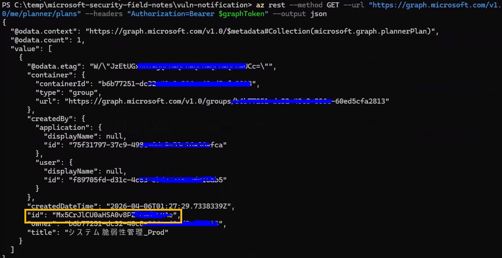
</p>
<p align="center"><em>Step 2: /me/planner/plans の出力から id（Plan ID）を取得</em></p>

#### Step 3. Plan に属する Bucket を確認

```powershell
$planId = "<PLAN_ID>"

az rest \
  --method GET \
  --url "https://graph.microsoft.com/v1.0/planner/plans/$planId/buckets" \
  --headers "Authorization=Bearer $graphToken" \
  --output json
```

1行版:

```powershell
az rest --method GET --url "https://graph.microsoft.com/v1.0/planner/plans/$planId/buckets" --headers "Authorization=Bearer $graphToken" --output json
```

出力の `value[].id` が Bucket ID (`bucket_id`) です。

#### Step 4. PowerShell で見やすく一覧表示（任意）

```powershell
$plans = Invoke-RestMethod -Method GET -Uri "https://graph.microsoft.com/v1.0/me/planner/plans" -Headers $graphHeaders
$plans.value | Select-Object id,title,owner | Format-Table -AutoSize

$planId = "<PLAN_ID>"
$buckets = Invoke-RestMethod -Method GET -Uri "https://graph.microsoft.com/v1.0/planner/plans/$planId/buckets" -Headers $graphHeaders
$buckets.value | Select-Object id,name,orderHint | Format-Table -AutoSize
```

#### Step 5. 取得した ID をテスト手順へ反映

- `-PlannerPlanId` に `plan_id` を指定
- `-PlannerBucketId` に `bucket_id` を指定
- JSON で送る場合は `planner.plan_id` と `planner.bucket_id` に指定

### 8. Function App のコードデプロイ

Function App のコード（`function_app.py` 等）を Azure にアップロードします。Function App 名はデプロイごとにサフィックスが異なるため、`$funcApp` 変数を使用します。

```powershell
$deploymentName = "vuln-notify-infra"
$funcUrl = az deployment group show -g vuln-notify-rg -n $deploymentName --query "properties.outputs.functionAppUrl.value" -o tsv
$funcApp = $funcUrl -replace '^https://','' -replace '\.azurewebsites\.net$',''
"Function App: $funcApp"

Push-Location function-app
func azure functionapp publish $funcApp --python --build local
Pop-Location
```

> [!WARNING]
> `Error creating a Blob container reference. Please make sure your connection string in "AzureWebJobsStorage" is valid` が出る場合は、`AzureWebJobsStorage` を再設定してから再デプロイしてください。
>
> ```powershell
> $stName = az storage account list -g vuln-notify-rg --query "[0].name" -o tsv
> $connStr = az storage account show-connection-string --name $stName --resource-group vuln-notify-rg --query connectionString -o tsv
> az functionapp config appsettings set --name $funcApp --resource-group vuln-notify-rg --settings "AzureWebJobsStorage=$connStr"
> az functionapp restart --name $funcApp --resource-group vuln-notify-rg
>
> # テンプレート修正（azuredeploy.bicep）を既存環境へ反映する場合
> az deployment group create --name $deploymentName --resource-group vuln-notify-rg --template-file azuredeploy.bicep --parameters "@azuredeploy.parameters.json"
>
> # Function App コードを再デプロイ
> Push-Location function-app
> func azure functionapp publish $funcApp --python --build local
> Pop-Location
> ```

<p align="center">
  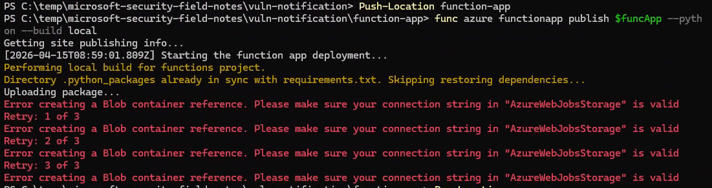
</p>
<p align="center"><em>AzureWebJobsStorage エラー発生時の復旧手順（実行例）</em></p>

> [!NOTE]
> 現在のテンプレートは Linux Consumption プラン（Y1 SKU）を使用しています。Linux Consumption は **2028年9月30日に EOL** となるため、本番運用では [Flex Consumption プラン](https://learn.microsoft.com/azure/azure-functions/flex-consumption-plan) への移行を検討してください。

## API 仕様（現在）

### エンドポイント

```http
POST https://<FUNCTION_APP_NAME>.azurewebsites.net/api/notify
Headers:
  Authorization: Bearer <user token or access_as_user token>
Content-Type: application/json
```

### 最小リクエスト例

```json
{
  "upns": [
    "analyst01@contoso.com",
    "owner01@contoso.com"
  ],
  "title": "脆弱性通知: CVE-2026-12345",
  "message": "OpenSSL の重大脆弱性を検知しました。"
}
```

### Planner 連携を有効化する例

```json
{
  "upns": [
    "analyst01@contoso.com",
    "owner01@contoso.com",
    "manager01@contoso.com"
  ],
  "planner": {
    "enabled": true,
    "plan_id": "<PLANNER_PLAN_ID>",
    "bucket_id": "<PLANNER_BUCKET_ID>"
  },
  "facts": {
    "cve_id": "CVE-2026-12345",
    "severity": "High",
    "cvss": "9.1",
    "component": "OpenSSL",
    "due_date": "2026-04-13"
  }
}
```

### Planner 担当者の仕様

- 既定: `upns` の全員を担当者として割り当て
- `planner.assignee_upn` を指定した場合: その 1 名のみ割り当て
- `planner.assignee_upns` を指定した場合: 指定した複数 UPN を割り当て

### 9. テスト手順

```powershell
$token = az account get-access-token --scope "api://<API_APP_ID>/access_as_user" --query accessToken -o tsv

.\function-app\Test-VulnNotify.ps1 \
  -UserAccessToken $token \
  -UserAccessToken $token \
  -Upns 'analyst01@contoso.com','owner01@contoso.com','manager01@contoso.com' \
  -CreatePlannerTask \
  -PlannerPlanId '<PLANNER_PLAN_ID>' \
  -PlannerBucketId '<PLANNER_BUCKET_ID>'
```

#### 最近の検証結果

- グループチャット投稿: 成功
- Planner タスク作成: 成功
- Planner 担当者 3 名割り当て: 成功

## 補足ドキュメント

詳細手順は `function-app/RUNBOOK.md` を参照してください。

送信側実装は `function-app/SENDER_GUIDE.md` を参照してください。
